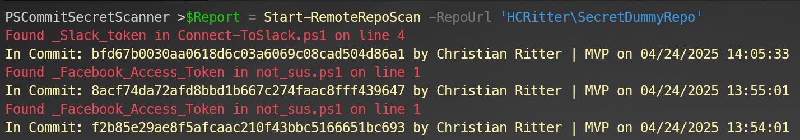
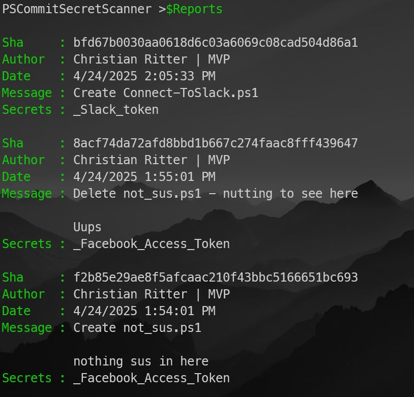

# PSCommitSecretScanner


**PSCommitSecretScanner** is a PowerShell module designed to scan remote Git repositories for secrets within commit history or live files. It provides automated detection of sensitive information like API keys, tokens, passwords, and other credentials in GitHub-hosted repositories.

## 🚀 Features

- Scan public or internal GitHub repositories
- Supports scanning recent commits
- Filters results by time (e.g., only last X days)
- Outputs full results or only commits with detected secrets
- Pattern-based scanning powered by configurable regexes

---

## 📊 Example

```PowerShell
Start-RemoteRepoScan -RepoUrl 'HCRitter\SecretDummyRepo' 
```

### 📺 Output





This command will:

- Pull the last 30 days of commits  
- Scan all changed files for secrets using pre-configured patterns  
- Output only commits that contain secrets  

## 🔐 Secret Pattern Detection

The module uses a pattern configuration loaded from `Get-PatternConfig`, which contains regular expressions to detect secrets like:

- AWS keys
- GitHub tokens
- Slack Webhooks
- JWTs
- Passwords in source files

You can extend this by editing your pattern config logic.

## 🛠 Roadmap Ideas

- Support for other GIT Provider
- Integration with CI pipelines
- Configurable pattern rules via external JSON
- Live Scan
- Scanning different Branches

## 🤝 Contribution

Contributions are welcome and appreciated!  
If you have ideas for improvements, bug fixes, or new features, feel free to open an issue or submit a pull request.

Before contributing, please:

- Fork the repository
- Create a new branch for your changes
- Test your updates thoroughly
- Follow the existing coding style and best practices

Let's make PSCommitScanner even better together!

## 🙏 Acknowledgements

A big thank you to the awesome community members who openly share their work and ideas — making tools like this possible!  

Special thanks to:

- **@bjompen** for his awesome [PSSecretScanner](https://github.com/Bjopmpen/PSSecretScanner) - Module; It has great regex patterns and I stole a lot of them 😁.
- The broader PowerShell and security communities for their contributions, discussions, and creativity.

Your open sharing of knowledge helps make the developer ecosystem better and safer for everyone! ❤️
